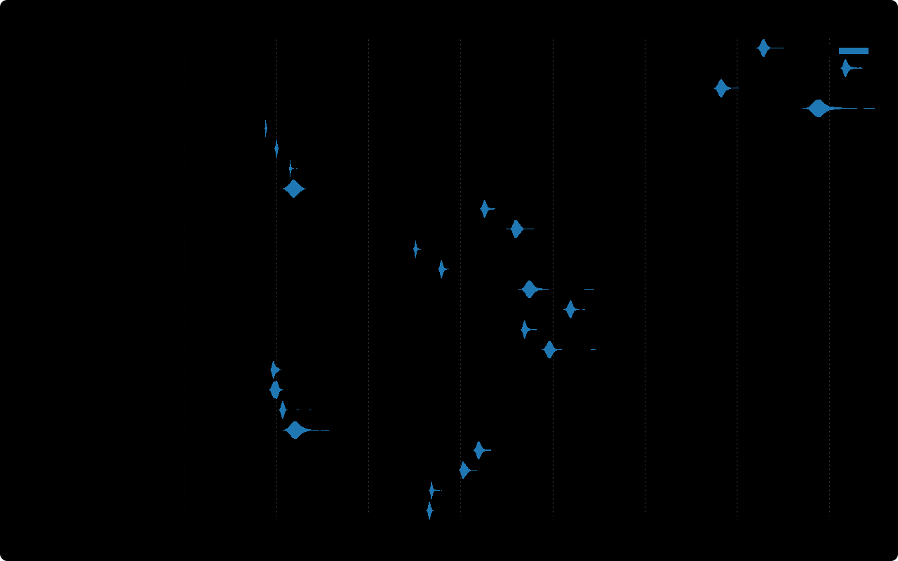

# streemap - Set of tree map algorithms

Algorithms:

- [x] Slice and Dice 😵.
- [x] Binary 👍.
- [x] [Squarified](https://www.win.tue.nl/~vanwijk/stm.pdf) 👍🚀 by Bruls, Mark; Huizing, Kees; van Wijk, Jarke J. (2000).
- [x] [Ordered](http://cvs.cs.umd.edu/~ben/papers/Shneiderman2001Ordered.pdf) by Shneiderman, Ben (2001).
- [ ] [Strip](http://www.cs.umd.edu/hcil/trs/2001-18/2001-18.pdf) by Benjamin, Bederson; Shneiderman, Ben; Wattenberg, Martin (2002).
- [ ] [Quantum](http://www.cs.umd.edu/hcil/trs/2001-18/2001-18.pdf) by Benjamin, Bederson; Shneiderman, Ben; Wattenberg, Martin (2002). _Quantized_ variant of other algorithms.

## Examples

### Depth 1

```
[6, 6, 4, 3, 2, 2, 1]
```

```rust
use streemap::Rect;

const R0: Rect<f32> = Rect { x: 0., y: 0., w: 0., h: 0. };
let mut slice = [(6., R0), (6., R0), (4., R0), (3., R0), (2., R0), (2., R0), (1., R0)];
streemap::squarify(
    Rect { x: 0., y: 0., w: 6., h: 4. },
    &mut slice[..],
    |&(n, _)| n, // map item to item size
    |(_, item_r), r| *item_r = r, // set item distributed rect
);
assert_eq!(
    slice,
    [
        (6.0, Rect { x: 0.0, y: 0.0, w: 3.0, h: 2.0 }),
        (6.0, Rect { x: 0.0, y: 2.0, w: 3.0, h: 2.0 }),
        (4.0, Rect { x: 3.0, y: 0.0, w: 1.7142857, h: 2.3333333 }),
        (3.0, Rect { x: 4.714286, y: 0.0, w: 1.2857141, h: 2.3333333 }),
        (2.0, Rect { x: 3.0, y: 2.3333333, w: 1.1999999, h: 1.6666667 }),
        (2.0, Rect { x: 4.2, y: 2.3333333, w: 1.1999999, h: 1.6666667 }),
        (1.0, Rect { x: 5.3999996, y: 2.3333333, w: 0.60000014, h: 1.6666667 })
    ]
);
streemap::binary(
    Rect { x: 0., y: 0., w: 6., h: 4. },
    &mut slice[..],
    |&(n, _)| n, // map item to item size
    |(_, item_r), r| *item_r = r, // set item distributed rect
);
assert_eq!(
    slice,
    [
        (6.0, Rect { x: 0.0, y: 0.0, w: 3.0, h: 2.0 }),
        (6.0, Rect { x: 0.0, y: 2.0, w: 3.0, h: 2.0 }),
        (4.0, Rect { x: 3.0, y: 0.0, w: 3.0, h: 1.3333334 }),
        (3.0, Rect { x: 3.0, y: 1.3333334, w: 1.125, h: 2.6666665 }),
        (2.0, Rect { x: 4.125, y: 1.3333334, w: 1.875, h: 1.0666667 }),
        (2.0, Rect { x: 4.125, y: 2.4, w: 1.25, h: 1.5999999 }),
        (1.0, Rect { x: 5.375, y: 2.4, w: 0.625, h: 1.5999999 })
    ]
);
```

**Performance**:



**Squarified**:


**Binary**:


**Ordered Pivot by middle**:


**Ordered Pivot by size**:


